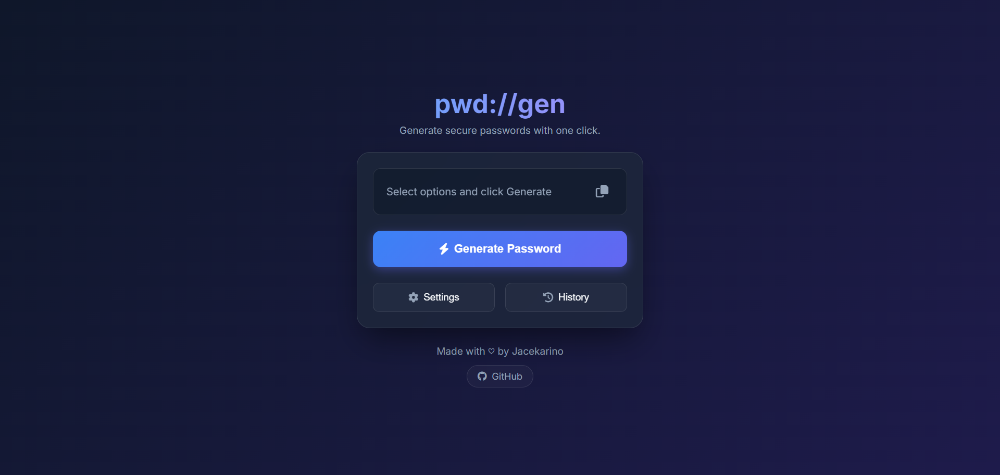

# Web app description:

pwd://gen is simple web app for generating random passwords. You can choose the length of the password, whether it should include uppercase letters, lowercase letters, numbers and symbols. You can also exclude certain characters from the password. Copy it to clipboard with one click!

# User interface:

# Running the project:

https://pwd-gen.pl/
https://pwd--gen.pages.dev/

Alternatively: Open index.html in your browser of choice.
